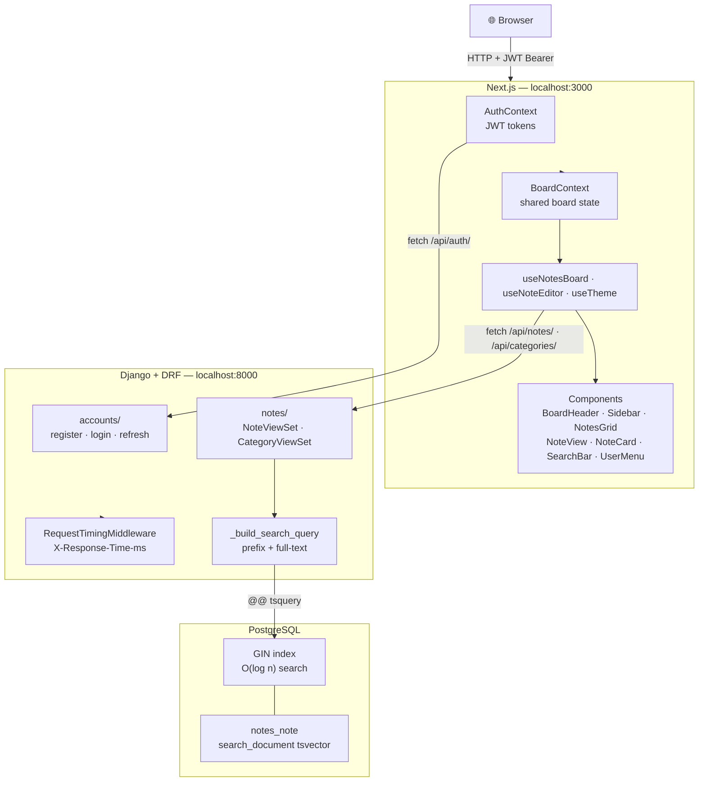

# Notes App — Full Stack Challenge

A monorepo notes board application built with a **Django + Django REST Framework** backend and a **Next.js (App Router) + TypeScript + Tailwind CSS** frontend. It reproduces a warm-cream design prototype with color-coded note cards, category filtering, and a full-screen markdown editor.

## Features

- **CRUD Notes** — create, read, update, and delete notes with title and markdown content
- **Categories** — organize notes into color-coded categories managed from the database
- **Category Filtering** — sidebar with live note counts per category; click to filter the board
- **Full-Screen Editor** — opens on click with a category dropdown, "Last Edited" timestamp, and autosave on blur/close
- **Markdown Support** — GitHub-flavored markdown with emoji shortcodes (`:tada:`) via `react-markdown` + `remark-gfm` + `remark-emoji`
- **Masonry Layout** — CSS-column staggered card grid with no JS layout library
- **Full-Text Search** — Postgres `tsvector` GIN index with prefix matching (`backen` finds "backend"); results ranked by relevance
- **User Authentication** — JWT-based register/login with per-user note scoping
- **Dark Mode** — toggleable via the user menu; preference persisted in `localStorage`
- **Django Admin** — built-in admin panel for managing notes and categories

## Tech Stack

| Layer      | Technology                                                    |
| ---------- | ------------------------------------------------------------- |
| Backend    | Django 5.2 LTS, Django REST Framework, django-filter, CORS   |
| Runtime    | Python 3.13 (`.python-version`, Docker `python:3.13-slim`)   |
| Database   | PostgreSQL (default); driven by `DATABASE_URL`               |
| Frontend   | Next.js 14 (App Router), React 18, TypeScript, Tailwind CSS 3 |
| Testing    | Django `APITestCase` (backend), Jest + React Testing Library  |
| Tooling    | uv (Python deps), pnpm 9 (JS deps), Docker / docker-compose  |

## Repository Structure

```
django-next-notes/
├── backend/                    # Django + DRF API
│   ├── config/                 # project settings, urls, wsgi
│   ├── notes/                  # models, serializers, views, tests
│   │   └── management/commands/seed.py  # sample data matching the design
│   ├── Dockerfile
│   ├── entrypoint.sh           # Docker startup script (migrate + seed + serve)
│   ├── pyproject.toml          # uv-managed dependencies
│   └── .env.example
├── frontend/                   # Next.js app
│   └── src/
│       ├── app/                # App Router entry (layout, page, globals.css)
│       ├── components/         # BoardHeader, NotesGrid, Sidebar, NoteCard,
│       │                       # NoteView, NoteToolbar, NoteEditor, NotePreview,
│       │                       # CategorySelect, Markdown
│       ├── hooks/              # useNotesBoard, useNoteEditor (state + logic)
│       └── lib/                # typed API client, types, date helpers
├── docker-compose.yml          # Postgres + backend + frontend, one command
├── Makefile                    # common dev commands
└── README.md
```

## Architecture



```
Browser
  │
  ▼
Next.js (App Router)                        localhost:3000
  ├── app/                                  layout, auth pages
  ├── contexts/
  │   ├── AuthContext      JWT tokens, login/signup/logout
  │   └── BoardContext     shared board state (notes, categories, editing)
  ├── hooks/
  │   ├── useNotesBoard    data fetching, filtering, CRUD operations
  │   ├── useNoteEditor    per-note form state, autosave, mode toggle
  │   └── useTheme         dark mode toggle + localStorage persistence
  └── components/
      ├── BoardHeader      layout only — composes SearchBar + UserMenu + New Note
      ├── SearchBar        debounced input → URL param → API query
      ├── UserMenu         profile dropdown (dark mode toggle, logout)
      ├── Sidebar          category list with live note counts
      ├── NotesGrid        masonry card grid
      ├── NoteCard         single card (color from category)
      ├── NoteView         full-screen overlay
      ├── NoteToolbar      category picker, preview/edit toggle, delete, close
      ├── NoteEditor       title + content inputs
      └── NotePreview      markdown renderer
  │
  │  HTTP + JWT Bearer token
  ▼
Django + DRF                                localhost:8000
  ├── config/
  │   ├── settings.py      env-driven config (DATABASE_URL, JWT, CORS)
  │   └── middleware.py    request timing → X-Response-Time-ms header
  ├── accounts/            register / login / token refresh endpoints
  └── notes/
      ├── models.py        Category, Note (search_document GeneratedField)
      ├── serializers.py   category_detail nested read-only on Note
      ├── views.py         NoteViewSet — prefix + full-text search query builder
      └── management/
          └── seed.py      idempotent sample data loader
  │
  ▼
PostgreSQL                                  port 5432
  ├── notes_note.search_document   GENERATED ALWAYS AS STORED tsvector
  └── notes_note_search_document_gin        GIN index for O(log n) search
```

### Request flow — search

```
User types "project backen"
  → SearchBar debounces 500 ms
  → URL: /?search=project+backen
  → useNotesBoard calls GET /api/notes/?search=project+backen
  → _build_search_query splits words:
      completed = ["project"]  → SearchQuery("project", type="plain")
      last      = "backen"     → SearchQuery("backen:*", type="raw")
      combined  = full_query & prefix_query
  → WHERE search_document @@ (to_tsquery('english','project') && to_tsquery('english','backen:*'))
  → GIN index lookup → ranked results
  → JSON response → NotesGrid re-renders
```

### Auth flow

```
POST /api/auth/register/  or  /api/auth/login/
  → returns { access, refresh }
  → stored in cookies (auth.ts)
  → every API request sends Authorization: Bearer <access>
  → on 401 → silent refresh via /api/auth/token/refresh/
  → on refresh failure → redirect to /login
```

## Quick Start (Docker — Recommended)

Requires Docker and Docker Compose.

```bash
docker compose up --build
```

Starts Postgres, runs migrations, seeds sample data, and serves:

| Service  | URL                          |
| -------- | ---------------------------- |
| Frontend | http://localhost:3000        |
| API      | http://localhost:8000/api    |
| Admin    | http://localhost:8000/admin  |

Admin credentials when seeded: **admin / admin**

Demo user (seeded for the notes board): **demo@notes.app / demo1234**

## Makefile Shortcuts

```bash
make start          # build + run the full stack via Docker
make down           # stop and remove the stack
make test           # run backend + frontend test suites
make migrate        # apply migrations (local, non-Docker)
make seed           # load sample notes (local)
make help           # list all available targets
```

## Manual Setup

Requires a running Postgres instance. Run `docker compose up db -d` to start just the database, then:

### Backend

```bash
make backend-install                              # create .venv and install Python deps
make migrate                                      # apply database migrations
make seed                                         # optional: load sample notes
cd backend && uv run python manage.py runserver   # http://localhost:8000
```

### Frontend

```bash
make frontend-install                             # install JS deps
cd frontend && pnpm dev                           # http://localhost:3000
```

## Environment Variables

### Backend (`backend/.env.example`)

| Variable                | Default                                        | Description                         |
| ----------------------- | ---------------------------------------------- | ----------------------------------- |
| `DJANGO_SECRET_KEY`     | `change-me-in-production`                      | Django secret key                   |
| `DJANGO_DEBUG`          | `True`                                         | Debug mode                          |
| `DJANGO_ALLOWED_HOSTS`  | `localhost,127.0.0.1,0.0.0.0`                 | Comma-separated allowed hosts       |
| `CORS_ALLOWED_ORIGINS`  | `http://localhost:3000,http://127.0.0.1:3000`  | CORS origins for the frontend       |
| `DATABASE_URL`          | _(unset — uses SQLite)_                        | Postgres connection string          |
| `SEED_DB`               | _(unset)_                                      | Set to `true` to auto-seed on start |

### Frontend (`frontend/.env.local.example`)

| Variable               | Default                        | Description      |
| ---------------------- | ------------------------------ | ---------------- |
| `NEXT_PUBLIC_API_URL`  | `http://localhost:8000/api`    | Backend API base URL |

## API Reference

All endpoints except the auth ones require a `Bearer <access_token>` header.

| Method             | Endpoint                    | Auth | Description                           |
| ------------------ | --------------------------- | ---- | ------------------------------------- |
| `GET`              | `/api/health/`              | No   | Liveness probe                        |
| `POST`             | `/api/auth/register/`       | No   | Create account → returns JWT tokens   |
| `POST`             | `/api/auth/login/`          | No   | Login → returns JWT tokens            |
| `POST`             | `/api/auth/token/refresh/`  | No   | Refresh access token                  |
| `GET` / `POST`     | `/api/categories/`          | Yes  | List (with `note_count`) / create     |
| `GET/PUT/PATCH/DEL`| `/api/categories/{id}/`     | Yes  | Retrieve / update / delete            |
| `GET` / `POST`     | `/api/notes/`               | Yes  | List (scoped to user) / create        |
| `GET/PUT/PATCH/DEL`| `/api/notes/{id}/`          | Yes  | Retrieve / update / delete            |

Notes query params: `?category=<id>`, `?search=<text>` (prefix + full-text), `?ordering=updated_at|created_at|title`.

Responses are paginated (`{ count, next, previous, results }`, default page size 50).

Every `/api/` request is timed — logged to console as `METHOD path -> status (X.XX ms)` and returned in the `X-Response-Time-ms` response header.

## Data Models

### Category

| Field        | Type        | Notes                             |
| ------------ | ----------- | --------------------------------- |
| `id`         | integer     | auto                              |
| `name`       | string(80)  | unique                            |
| `color`      | string(7)   | hex color, default `#F4C77B`      |
| `created_at` | datetime    | auto                              |
| `note_count` | integer     | annotated read-only field         |

### Note

| Field             | Type        | Notes                                                      |
| ----------------- | ----------- | ---------------------------------------------------------- |
| `id`              | integer     | auto                                                       |
| `user`            | FK          | `CASCADE` on user delete; scopes all queries               |
| `title`           | string(255) | required                                                   |
| `content`         | text        | markdown, optional                                         |
| `category`        | FK          | `SET_NULL` on category delete                              |
| `search_document` | tsvector    | `GENERATED ALWAYS AS STORED`; weighted A/B; GIN indexed    |
| `created_at`      | datetime    | auto                                                       |
| `updated_at`      | datetime    | auto, default ordering (`-updated_at`)                     |

The serializer exposes both `category` (writable PK) and `category_detail` (nested read-only) so the client renders color/name without an extra request.

## Tests

```bash
make test            # run backend + frontend suites with coverage
make test-backend    # backend only (pytest + coverage, 95% minimum enforced)
make test-frontend   # frontend only (Jest + coverage, 95% minimum enforced)
```

## Key Design Decisions

- **Monorepo** — backend and frontend in one repo for a single source of truth and a one-command Docker setup, while staying cleanly separated so either could be deployed independently.
- **Category colour on the model** — each `Category` stores a hex `color`, so card tints and sidebar dots are data-driven; adding a category needs no frontend change.
- **`note_count` annotated in the queryset** — `Count("notes")` keeps the sidebar a single query instead of N+1.
- **Environment-driven database** — `dj-database-url` reads `DATABASE_URL`; defaults to a local Postgres instance matching the docker-compose credentials.
- **`on_delete=SET_NULL`** — deleting a category keeps its notes rather than cascading.
- **Full-text search with prefix matching** — `search_document` is a `GENERATED ALWAYS AS STORED` tsvector (title weight A, content weight B) backed by a GIN index. Queries combine full stemming for completed words and `:*` prefix for the last word, so "backen" matches "backend" without a sequential scan.
- **Single Responsibility components** — `BoardHeader` composes `SearchBar`, `UserMenu`, and the New Note button; each has its own test file.
- **CSS variable theming** — all colors are CSS variables in `globals.css`; dark mode flips them via `[data-theme="dark"]`, so every component adapts without per-component overrides.
- **Thin, typed API client** — `src/lib/api.ts` centralises fetch logic and error handling; components stay presentational.
- **Hooks/components split** — state and side effects live in `useNotesBoard`, `useNoteEditor`, and `useTheme`; components are thin and independently testable.
- **CSS-column masonry** — reproduces the staggered card layout without a JS layout library.
- **Autosave** — note changes save on blur and on editor close; creating a note skips empty titles and promotes a new note to an existing one on first save.
- **Request timing middleware** — logs and exposes response time on every API call for quick inspection.
- **Test coverage** — backend 100% coverage (pytest + testcontainers); frontend 95%+ across statements, branches, functions, and lines.
